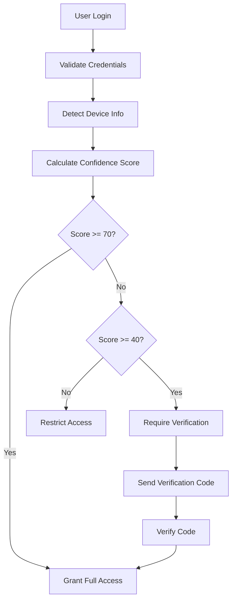
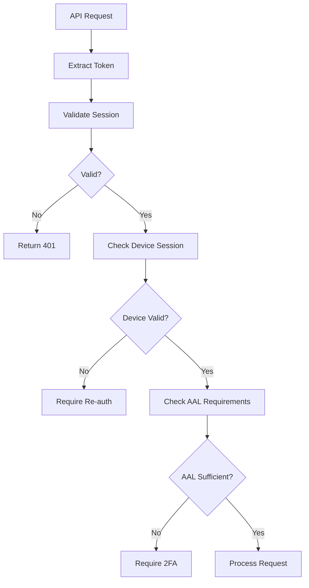

# Architecture et Plan du Projet

> Vue d'ensemble de l'architecture et structure du starter SaaS

## Vision du projet

Créer un starter SaaS complet, scalable et personnalisable basé sur l'approche Mazeway :
- **Owned code** : Tout le code d'authentification appartient au projet
- **Full customization** : Modification complète possible de chaque composant
- **Production ready** : Sécurité enterprise, monitoring, tests inclus
- **Scalable** : Architecture pensée pour la croissance

## Architecture globale

### Frontend (Next.js 15)
```
app/
├── (auth)/                 # Groupe de routes auth
│   ├── signin/            # Page de connexion
│   ├── signup/            # Page d'inscription  
│   ├── verify/            # Vérification email/device
│   └── reset-password/    # Reset mot de passe
├── (dashboard)/           # Interface utilisateur connecté
│   ├── settings/          # Paramètres compte
│   ├── security/          # Gestion sécurité/devices
│   └── activity/          # Historique activité
├── api/                   # Routes API
│   ├── auth/              # Endpoints authentification
│   ├── user/              # Gestion profil utilisateur
│   └── admin/             # Routes administration
└── globals.css            # Styles globaux
```

### Backend (Supabase + Custom Logic)
```
Database Schema:
├── auth.users             # Table Supabase native
├── public.users           # Profils utilisateurs custom
├── public.devices         # Appareils détectés
├── public.device_sessions # Sessions avec scoring
├── public.verification_codes # Codes de vérification
├── public.backup_codes    # Codes 2FA de sauvegarde
└── public.account_events  # Journal d'activité
```

### Services externes
- **Supabase** : Database + Auth base
- **Upstash Redis** : Cache + Rate limiting
- **Resend** : Service email transactionnel
- **Sentry** (optionnel) : Monitoring erreurs

## Modules principaux

### 1. Module Authentification
**Responsabilités :**
- Connexion/inscription multi-providers
- Gestion des sessions avec scoring de confiance
- Vérification 2FA et backup codes
- Reset/changement de mots de passe

**Composants clés :**
```typescript
// Utilitaires core
/utils/auth.ts              # Fonctions auth principales
/utils/device-detection.ts  # Détection et scoring devices
/utils/session-manager.ts   # Gestion sessions custom
/utils/verification.ts      # Codes de vérification

// Hooks React
/hooks/useAuth.ts          # Hook auth principal
/hooks/useDeviceSession.ts # Hook session device
/hooks/use2FA.ts           # Hook gestion 2FA

// Composants UI
/components/auth/          # Formulaires auth
/components/security/      # Interface sécurité
```

### 2. Module Sécurité
**Responsabilités :**
- Rate limiting intelligent
- Détection d'activité suspecte
- Gestion des niveaux d'assurance (AAL)
- Audit et logging

**Composants clés :**
```typescript
// Middlewares
/middleware/rate-limit.ts   # Rate limiting Redis
/middleware/security.ts     # Vérifications sécurité
/middleware/audit.ts        # Logging activité

// Services
/services/threat-detection.ts # Détection menaces
/services/notification.ts     # Alertes sécurité
```

### 3. Module Gestion Utilisateur
**Responsabilités :**
- Profils et paramètres utilisateur
- Gestion des préférences
- Export de données (GDPR)
- Suppression de compte

### 4. Module Email
**Responsabilités :**
- Templates email responsive
- Envoi transactionnel via Resend
- Personnalisation par tenant

**Templates disponibles :**
- Welcome/onboarding
- Vérification email
- Reset mot de passe
- Alerte nouvelle connexion
- Alerte activité suspecte
- Export de données prêt

### 5. Module Admin (optionnel)
**Responsabilités :**
- Dashboard administrateur
- Gestion des utilisateurs
- Métriques et analytics
- Configuration système

## Patterns d'architecture

### 1. Separation of Concerns
```typescript
// Structure type d'un module
modules/auth/
├── components/        # Composants React
├── hooks/            # Hooks métier  
├── services/         # Logique business
├── types/            # Types TypeScript
├── utils/            # Utilitaires
└── config/           # Configuration
```

### 2. Configuration centralisée
```typescript
// /config/index.ts - Point d'entrée configuration
export { authConfig } from './auth';
export { emailConfig } from './email';  
export { securityConfig } from './security';
export { uiConfig } from './ui';

// Permet l'override par env
export const config = {
  ...defaultConfig,
  ...process.env.NODE_ENV === 'production' ? prodConfig : devConfig
};
```

### 3. Type safety complet
```typescript
// Types globaux dans /types/
export interface User {
  id: string;
  email: string;
  name: string;
  // ...
}

export interface DeviceSession {
  id: string;
  confidence_score: number;
  aal: 'aal1' | 'aal2';
  // ...
}

// Génération automatique des types DB
export type Database = // Auto-généré depuis Supabase
```

### 4. Error handling unifié
```typescript
// /lib/errors.ts
export class AppError extends Error {
  constructor(
    public code: string,
    message: string,
    public statusCode: number = 500
  ) {
    super(message);
  }
}

// Usage dans les API routes
try {
  await authenticateUser(credentials);
} catch (error) {
  return handleApiError(error);
}
```

## Data Flow

### 1. Authentification flow


### 2. Session management


## Scalabilité

### 1. Database scaling
- **Indexing strategy** : Index sur user_id, device_id, created_at
- **Partitioning** : Partition des events par date
- **Archiving** : Archivage automatique des données anciennes

### 2. Caching strategy
```typescript
// Cache hiérarchique
Level 1: Browser cache (session data)
Level 2: CDN cache (static assets)
Level 3: Redis cache (user sessions, rate limits)
Level 4: Database (persistent data)
```

### 3. Rate limiting adaptatif
```typescript
// Limites dynamiques basées sur le comportement
const getRateLimit = (user: User, endpoint: string) => {
  const baseLimit = config.rateLimits[endpoint];
  const userTrustScore = calculateUserTrustScore(user);
  
  // Utilisateurs fiables = limites plus élevées
  return Math.floor(baseLimit * (1 + userTrustScore / 100));
};
```

## Sécurité

### 1. Defense in depth
- **Input validation** : Zod schemas sur toutes les entrées
- **Output encoding** : Sanitisation automatique
- **Rate limiting** : Multi-niveaux (IP, user, endpoint)
- **CSRF protection** : Tokens CSRF sur actions sensibles
- **XSS protection** : Content Security Policy strict

### 2. Monitoring sécurité
```typescript
// Events à surveiller
const securityEvents = {
  'failed_login_attempts': { threshold: 5, window: 300 },
  'new_device_login': { threshold: 3, window: 3600 },
  'password_reset_requests': { threshold: 3, window: 3600 },
  'suspicious_location': { threshold: 1, window: 0 }
};
```

## Testing Strategy

### 1. Tests unitaires
- **Utils** : 100% coverage sur les fonctions critiques
- **Hooks** : Tests avec React Testing Library
- **Services** : Mocks des APIs externes

### 2. Tests d'intégration
- **API routes** : Tests end-to-end avec base de test
- **Auth flows** : Scénarios complets utilisateur
- **Security** : Tests des vulnérabilités connues

### 3. Tests de performance
- **Load testing** : Simulation de charge sur auth endpoints
- **Database performance** : Tests des requêtes complexes
- **Memory leaks** : Monitoring mémoire en continu

## Deployment

### 1. Environnements
```typescript
// Development
- Local database (Docker)
- Local Redis (Docker)  
- Mock email service

// Staging  
- Supabase staging project
- Upstash Redis staging
- Resend test mode

// Production
- Supabase production
- Upstash Redis production  
- Resend production
- Monitoring (Sentry, etc.)
```

### 2. CI/CD Pipeline
```yaml
# .github/workflows/deploy.yml
1. Code quality (ESLint, Prettier)
2. Type checking (TypeScript)
3. Unit tests
4. Integration tests
5. Security scan
6. Build application
7. Deploy to staging
8. E2E tests on staging
9. Deploy to production
```

## Extensibilité

### 1. Plugin system
```typescript
// /plugins/interface.ts
export interface AuthPlugin {
  name: string;
  setup: (config: PluginConfig) => void;
  hooks: {
    beforeAuth?: (data: AuthData) => AuthData;
    afterAuth?: (user: User) => void;
    onSecurityEvent?: (event: SecurityEvent) => void;
  };
}

// Exemples de plugins
- SSO enterprise (SAML, OIDC)
- Biometric authentication
- Custom threat detection
- Advanced analytics
```

### 2. Multi-tenancy ready
```typescript
// Structure pour multi-tenant
export interface TenantConfig {
  id: string;
  domain: string;
  auth: {
    providers: string[];
    customization: AuthCustomization;
  };
  security: SecuritySettings;
  branding: BrandingConfig;
}
```

## Performance Goals

### 1. Métriques cibles
- **Auth response time** : < 200ms (P95)
- **Page load time** : < 1s (First Contentful Paint)
- **Database queries** : < 50ms (P95)
- **Cache hit ratio** : > 95%

### 2. Optimisations
- **Code splitting** : Lazy loading des routes
- **Bundle optimization** : Tree shaking agressif
- **Image optimization** : Next.js Image component
- **Database optimization** : Query optimization, connection pooling
