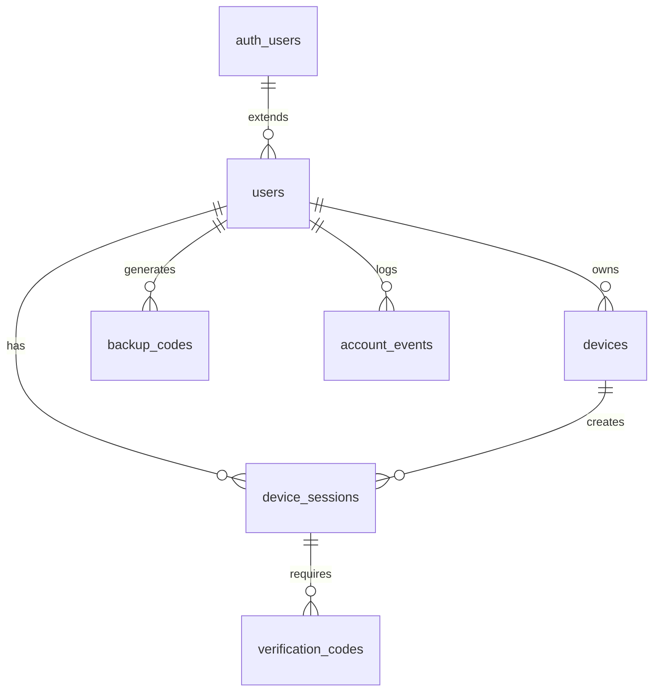

# Base de données et schémas

> Documentation complète de la structure de base de données et des schémas

## Vue d'ensemble

La base de données utilise PostgreSQL via Supabase avec :
- Schéma `auth` géré par Supabase pour l'authentification de base
- Schéma `public` custom pour la logique métier étendue
- Row Level Security (RLS) activée sur toutes les tables
- Triggers automatiques pour les timestamps
- Index optimisés pour les performances

## Architecture de la base de données

### Relations principales


## Tables et schémas

### Table `auth.users` (Supabase native)
```sql
-- Gérée automatiquement par Supabase
CREATE TABLE auth.users (
  id uuid PRIMARY KEY DEFAULT gen_random_uuid(),
  instance_id uuid,
  email text UNIQUE,
  encrypted_password text,
  email_confirmed_at timestamptz,
  invited_at timestamptz,
  confirmation_token text,
  confirmation_sent_at timestamptz,
  recovery_token text,
  recovery_sent_at timestamptz,
  email_change_token_new text,
  email_change text,
  email_change_sent_at timestamptz,
  last_sign_in_at timestamptz,
  raw_app_meta_data jsonb,
  raw_user_meta_data jsonb,
  is_super_admin boolean,
  created_at timestamptz,
  updated_at timestamptz,
  phone text,
  phone_confirmed_at timestamptz,
  phone_change text,
  phone_change_token text,
  phone_change_sent_at timestamptz,
  confirmed_at timestamptz,
  email_change_token_current text,
  email_change_confirm_status smallint,
  banned_until timestamptz,
  reauthentication_token text,
  reauthentication_sent_at timestamptz,
  is_sso_user boolean DEFAULT false,
  deleted_at timestamptz
);
```

### Table `public.users` - Profils utilisateur étendus
```sql
CREATE TABLE public.users (
  id uuid PRIMARY KEY REFERENCES auth.users(id) ON DELETE CASCADE,
  email text UNIQUE NOT NULL,
  name text NOT NULL,
  avatar_url text,
  
  -- Flags de sécurité
  has_password boolean DEFAULT false,
  has_backup_codes boolean DEFAULT false,
  email_verified boolean DEFAULT false,
  
  -- Métadonnées
  last_active_at timestamptz,
  timezone text DEFAULT 'UTC',
  locale text DEFAULT 'en',
  
  -- Timestamps
  created_at timestamptz DEFAULT now(),
  updated_at timestamptz DEFAULT now(),
  
  -- Contraintes
  CONSTRAINT users_name_length CHECK (char_length(name) >= 2 AND char_length(name) <= 50),
  CONSTRAINT users_email_format CHECK (email ~* '^[A-Za-z0-9._%+-]+@[A-Za-z0-9.-]+\.[A-Za-z]{2,}$')
);

-- RLS
ALTER TABLE public.users ENABLE ROW LEVEL SECURITY;

-- Policies
CREATE POLICY "Users can view own profile"
  ON public.users FOR SELECT
  USING (auth.uid() = id);

CREATE POLICY "Users can update own profile"
  ON public.users FOR UPDATE
  USING (auth.uid() = id);

CREATE POLICY "Users can insert own profile"
  ON public.users FOR INSERT
  WITH CHECK (auth.uid() = id);

-- Triggers
CREATE TRIGGER update_users_updated_at
  BEFORE UPDATE ON public.users
  FOR EACH ROW
  EXECUTE FUNCTION update_updated_at_column();

-- Index
CREATE INDEX idx_users_email ON public.users(email);
CREATE INDEX idx_users_last_active ON public.users(last_active_at);
```

### Table `devices` - Appareils détectés
```sql
CREATE TABLE public.devices (
  id uuid PRIMARY KEY DEFAULT gen_random_uuid(),
  user_id uuid REFERENCES public.users(id) ON DELETE CASCADE NOT NULL,
  
  -- Informations de l'appareil
  device_name text,
  browser text,
  browser_version text,
  os text,
  os_version text,
  platform text,
  
  -- Informations réseau
  ip_address inet,
  user_agent text,
  
  -- Géolocalisation (optionnelle)
  country text,
  city text,
  latitude decimal(10,8),
  longitude decimal(11,8),
  
  -- Métadonnées
  first_seen_at timestamptz DEFAULT now(),
  last_seen_at timestamptz DEFAULT now(),
  total_logins integer DEFAULT 1,
  
  -- Timestamps
  created_at timestamptz DEFAULT now(),
  updated_at timestamptz DEFAULT now(),
  
  -- Contraintes
  CONSTRAINT devices_device_name_length CHECK (char_length(device_name) <= 100),
  CONSTRAINT devices_total_logins_positive CHECK (total_logins >= 0)
);

-- RLS
ALTER TABLE public.devices ENABLE ROW LEVEL SECURITY;

-- Policies
CREATE POLICY "Users can manage own devices"
  ON public.devices FOR ALL
  USING (user_id = auth.uid());

-- Triggers
CREATE TRIGGER update_devices_updated_at
  BEFORE UPDATE ON public.devices
  FOR EACH ROW
  EXECUTE FUNCTION update_updated_at_column();

-- Index
CREATE INDEX idx_devices_user_id ON public.devices(user_id);
CREATE INDEX idx_devices_last_seen ON public.devices(last_seen_at);
CREATE INDEX idx_devices_ip_address ON public.devices(ip_address);
CREATE UNIQUE INDEX idx_devices_user_fingerprint 
  ON public.devices(user_id, browser, os, platform) 
  WHERE device_name IS NOT NULL;
```

### Table `device_sessions` - Sessions avec scoring
```sql
CREATE TABLE public.device_sessions (
  id uuid PRIMARY KEY DEFAULT gen_random_uuid(),
  user_id uuid REFERENCES public.users(id) ON DELETE CASCADE NOT NULL,
  device_id uuid REFERENCES public.devices(id) ON DELETE CASCADE,
  
  -- Session Supabase liée
  supabase_session_id uuid,
  
  -- Scoring et confiance
  confidence_score integer DEFAULT 0 CHECK (confidence_score >= 0 AND confidence_score <= 100),
  is_trusted boolean DEFAULT false,
  needs_verification boolean DEFAULT true,
  
  -- Niveau d'assurance authentification
  aal text DEFAULT 'aal1' CHECK (aal IN ('aal1', 'aal2')),
  
  -- Informations de session
  ip_address inet,
  user_agent text,
  session_data jsonb DEFAULT '{}',
  
  -- Timestamps de vérification
  device_verified_at timestamptz,
  last_sensitive_verification_at timestamptz,
  last_activity_at timestamptz DEFAULT now(),
  
  -- Expiration
  expires_at timestamptz NOT NULL,
  
  -- Métadonnées sécurité
  security_flags jsonb DEFAULT '{}',
  risk_score integer DEFAULT 0 CHECK (risk_score >= 0 AND risk_score <= 100),
  
  -- Timestamps
  created_at timestamptz DEFAULT now(),
  updated_at timestamptz DEFAULT now(),
  
  -- Contraintes
  CONSTRAINT device_sessions_expires_future CHECK (expires_at > created_at)
);

-- RLS
ALTER TABLE public.device_sessions ENABLE ROW LEVEL SECURITY;

-- Policies
CREATE POLICY "Users can view own device sessions"
  ON public.device_sessions FOR SELECT
  USING (user_id = auth.uid());

CREATE POLICY "Users can update own device sessions"
  ON public.device_sessions FOR UPDATE
  USING (user_id = auth.uid());

-- Triggers
CREATE TRIGGER update_device_sessions_updated_at
  BEFORE UPDATE ON public.device_sessions
  FOR EACH ROW
  EXECUTE FUNCTION update_updated_at_column();

-- Index
CREATE INDEX idx_device_sessions_user_id ON public.device_sessions(user_id);
CREATE INDEX idx_device_sessions_device_id ON public.device_sessions(device_id);
CREATE INDEX idx_device_sessions_expires ON public.device_sessions(expires_at);
CREATE INDEX idx_device_sessions_last_activity ON public.device_sessions(last_activity_at);
CREATE UNIQUE INDEX idx_device_sessions_supabase ON public.device_sessions(supabase_session_id) 
  WHERE supabase_session_id IS NOT NULL;
```

### Table `verification_codes` - Codes de vérification
```sql
CREATE TABLE public.verification_codes (
  id uuid PRIMARY KEY DEFAULT gen_random_uuid(),
  device_session_id uuid REFERENCES public.device_sessions(id) ON DELETE CASCADE,
  
  -- Code haché pour sécurité
  code_hash text NOT NULL,
  salt text NOT NULL,
  
  -- Type de vérification
  verification_type text DEFAULT 'device' CHECK (verification_type IN ('device', 'email', '2fa', 'password_reset')),
  
  -- Métadonnées
  attempts integer DEFAULT 0,
  max_attempts integer DEFAULT 5,
  
  -- Expiration
  expires_at timestamptz NOT NULL,
  used_at timestamptz,
  
  -- Contact (email/téléphone)
  contact_info text,
  
  -- Timestamps
  created_at timestamptz DEFAULT now(),
  updated_at timestamptz DEFAULT now(),
  
  -- Contraintes
  CONSTRAINT verification_codes_attempts_valid CHECK (attempts >= 0 AND attempts <= max_attempts),
  CONSTRAINT verification_codes_expires_future CHECK (expires_at > created_at)
);

-- RLS
ALTER TABLE public.verification_codes ENABLE ROW LEVEL SECURITY;

-- Policies
CREATE POLICY "Users can access own verification codes"
  ON public.verification_codes FOR ALL
  USING (
    device_session_id IN (
      SELECT id FROM public.device_sessions WHERE user_id = auth.uid()
    )
  );

-- Triggers
CREATE TRIGGER update_verification_codes_updated_at
  BEFORE UPDATE ON public.verification_codes
  FOR EACH ROW
  EXECUTE FUNCTION update_updated_at_column();

-- Index
CREATE INDEX idx_verification_codes_device_session ON public.verification_codes(device_session_id);
CREATE INDEX idx_verification_codes_expires ON public.verification_codes(expires_at);
CREATE INDEX idx_verification_codes_type ON public.verification_codes(verification_type);
```

### Table `backup_codes` - Codes de sauvegarde 2FA
```sql
CREATE TABLE public.backup_codes (
  id uuid PRIMARY KEY DEFAULT gen_random_uuid(),
  user_id uuid REFERENCES public.users(id) ON DELETE CASCADE NOT NULL,
  
  -- Code haché
  code_hash text NOT NULL,
  salt text NOT NULL,
  
  -- Utilisation
  used_at timestamptz,
  used_from_ip inet,
  used_device_id uuid REFERENCES public.devices(id),
  
  -- Métadonnées
  code_number integer CHECK (code_number >= 1 AND code_number <= 10),
  
  -- Timestamps
  created_at timestamptz DEFAULT now(),
  updated_at timestamptz DEFAULT now()
);

-- RLS
ALTER TABLE public.backup_codes ENABLE ROW LEVEL SECURITY;

-- Policies
CREATE POLICY "Users can manage own backup codes"
  ON public.backup_codes FOR ALL
  USING (user_id = auth.uid());

-- Triggers
CREATE TRIGGER update_backup_codes_updated_at
  BEFORE UPDATE ON public.backup_codes
  FOR EACH ROW
  EXECUTE FUNCTION update_updated_at_column();

-- Index
CREATE INDEX idx_backup_codes_user_id ON public.backup_codes(user_id);
CREATE INDEX idx_backup_codes_used_at ON public.backup_codes(used_at);
CREATE UNIQUE INDEX idx_backup_codes_user_number ON public.backup_codes(user_id, code_number);
```

### Table `account_events` - Journal d'activité
```sql
CREATE TABLE public.account_events (
  id uuid PRIMARY KEY DEFAULT gen_random_uuid(),
  user_id uuid REFERENCES public.users(id) ON DELETE CASCADE,
  device_session_id uuid REFERENCES public.device_sessions(id) ON DELETE SET NULL,
  
  -- Type d'événement
  event_type text NOT NULL,
  event_category text DEFAULT 'security' CHECK (event_category IN ('auth', 'security', 'profile', 'admin')),
  
  -- Détails de l'événement
  description text,
  metadata jsonb DEFAULT '{}',
  
  -- Informations contextuelles
  ip_address inet,
  user_agent text,
  location jsonb, -- { country, city, coordinates }
  
  -- Niveau de sévérité
  severity text DEFAULT 'info' CHECK (severity IN ('info', 'warning', 'error', 'critical')),
  
  -- Statut
  status text DEFAULT 'success' CHECK (status IN ('success', 'failure', 'pending')),
  
  -- Timestamps
  created_at timestamptz DEFAULT now(),
  
  -- Contraintes
  CONSTRAINT account_events_event_type_length CHECK (char_length(event_type) <= 50)
);

-- RLS
ALTER TABLE public.account_events ENABLE ROW LEVEL SECURITY;

-- Policies
CREATE POLICY "Users can view own events"
  ON public.account_events FOR SELECT
  USING (user_id = auth.uid());

-- Index
CREATE INDEX idx_account_events_user_id_created ON public.account_events(user_id, created_at DESC);
CREATE INDEX idx_account_events_type ON public.account_events(event_type);
CREATE INDEX idx_account_events_category ON public.account_events(event_category);
CREATE INDEX idx_account_events_severity ON public.account_events(severity);
CREATE INDEX idx_account_events_created_at ON public.account_events(created_at);

-- Partitioning pour performance (optionnel)
-- CREATE TABLE account_events_y2024m01 PARTITION OF account_events
-- FOR VALUES FROM ('2024-01-01') TO ('2024-02-01');
```

## Fonctions et triggers

### Fonction de mise à jour des timestamps
```sql
-- Fonction réutilisable pour updated_at
CREATE OR REPLACE FUNCTION public.update_updated_at_column()
RETURNS TRIGGER 
SECURITY DEFINER
SET search_path = public
AS $$
BEGIN
  NEW.updated_at = now();
  RETURN NEW;
END;
$$ LANGUAGE plpgsql;
```

### Fonction de vérification de mot de passe
```sql
-- Vérification mot de passe sans affecter l'AAL
CREATE OR REPLACE FUNCTION public.verify_user_password(password text)
RETURNS BOOLEAN 
SECURITY DEFINER 
SET search_path = auth, public
AS $$
BEGIN
  RETURN EXISTS (
    SELECT 1 
    FROM auth.users 
    WHERE id = auth.uid() 
    AND encrypted_password = crypt(password::text, auth.users.encrypted_password)
  );
END;
$$ LANGUAGE plpgsql;
```

### Fonction de nettoyage automatique
```sql
-- Nettoyage des données expirées
CREATE OR REPLACE FUNCTION public.cleanup_expired_data()
RETURNS void
SECURITY DEFINER
SET search_path = public
AS $$
BEGIN
  -- Supprimer les codes de vérification expirés
  DELETE FROM verification_codes 
  WHERE expires_at < now() - interval '1 hour';
  
  -- Supprimer les sessions device expirées
  DELETE FROM device_sessions 
  WHERE expires_at < now();
  
  -- Archiver les anciens événements (> 90 jours)
  DELETE FROM account_events 
  WHERE created_at < now() - interval '90 days'
  AND event_category != 'critical';
  
  -- Log du nettoyage
  INSERT INTO account_events (
    event_type, 
    event_category, 
    description, 
    severity
  ) VALUES (
    'cleanup_executed',
    'admin',
    'Nettoyage automatique des données expirées',
    'info'
  );
END;
$$ LANGUAGE plpgsql;
```

### Trigger de mise à jour de l'activité
```sql
-- Mise à jour automatique de last_active_at
CREATE OR REPLACE FUNCTION public.update_user_activity()
RETURNS TRIGGER
SECURITY DEFINER
SET search_path = public
AS $$
BEGIN
  -- Mettre à jour last_active_at de l'utilisateur
  UPDATE users 
  SET last_active_at = now()
  WHERE id = NEW.user_id;
  
  -- Mettre à jour last_activity_at de la session device
  UPDATE device_sessions 
  SET last_activity_at = now()
  WHERE id = NEW.device_session_id;
  
  RETURN NEW;
END;
$$ LANGUAGE plpgsql;

-- Appliquer le trigger sur les événements d'activité
CREATE TRIGGER trigger_update_user_activity
  AFTER INSERT ON account_events
  FOR EACH ROW
  WHEN (NEW.event_category IN ('auth', 'profile'))
  EXECUTE FUNCTION update_user_activity();
```

## Types TypeScript générés

### Types de base
```typescript
// Généré automatiquement depuis Supabase
export interface Database {
  public: {
    Tables: {
      users: {
        Row: {
          id: string;
          email: string;
          name: string;
          avatar_url: string | null;
          has_password: boolean;
          has_backup_codes: boolean;
          email_verified: boolean;
          last_active_at: string | null;
          timezone: string;
          locale: string;
          created_at: string;
          updated_at: string;
        };
        Insert: {
          id: string;
          email: string;
          name: string;
          avatar_url?: string | null;
          has_password?: boolean;
          has_backup_codes?: boolean;
          email_verified?: boolean;
          timezone?: string;
          locale?: string;
        };
        Update: {
          email?: string;
          name?: string;
          avatar_url?: string | null;
          has_password?: boolean;
          has_backup_codes?: boolean;
          email_verified?: boolean;
          last_active_at?: string | null;
          timezone?: string;
          locale?: string;
        };
      };
      // ... autres tables
    };
    Functions: {
      verify_user_password: {
        Args: { password: string };
        Returns: boolean;
      };
      cleanup_expired_data: {
        Args: Record<PropertyKey, never>;
        Returns: void;
      };
    };
  };
}

// Types d'événements
export type EventType = 
  | 'user_created'
  | 'user_login'
  | 'user_logout'
  | 'password_changed'
  | 'email_changed'
  | 'device_added'
  | 'device_verified'
  | 'suspicious_activity'
  | 'security_alert';

export type EventCategory = 'auth' | 'security' | 'profile' | 'admin';
export type EventSeverity = 'info' | 'warning' | 'error' | 'critical';
export type DeviceTrustLevel = 'trusted' | 'verified' | 'restricted';
export type AAL = 'aal1' | 'aal2';
```

## Migrations et versioning

### Structure des migrations
```sql
-- Migration 001: Tables de base
-- /supabase/migrations/20240101000001_initial_schema.sql

-- Migration 002: Ajout de colonnes de sécurité
-- /supabase/migrations/20240102000002_add_security_columns.sql
ALTER TABLE device_sessions 
ADD COLUMN risk_score integer DEFAULT 0 CHECK (risk_score >= 0 AND risk_score <= 100),
ADD COLUMN security_flags jsonb DEFAULT '{}';

-- Migration 003: Index de performance
-- /supabase/migrations/20240103000003_add_performance_indexes.sql
CREATE INDEX CONCURRENTLY idx_device_sessions_risk_score 
ON device_sessions(risk_score) WHERE risk_score > 50;

-- Migration 004: Fonctions de nettoyage
-- /supabase/migrations/20240104000004_cleanup_functions.sql
-- (Contenu des fonctions ci-dessus)
```

### Scripts de seed pour développement
```sql
-- /supabase/seed.sql
-- Données de test pour développement

-- Utilisateur de test
INSERT INTO auth.users (id, email, encrypted_password, email_confirmed_at)
VALUES (
  '550e8400-e29b-41d4-a716-446655440000',
  'test@example.com',
  crypt('password123', gen_salt('bf')),
  now()
);

INSERT INTO public.users (id, email, name, email_verified)
VALUES (
  '550e8400-e29b-41d4-a716-446655440000',
  'test@example.com',
  'Test User',
  true
);

-- Appareil de test
INSERT INTO public.devices (user_id, device_name, browser, os, ip_address)
VALUES (
  '550e8400-e29b-41d4-a716-446655440000',
  'MacBook Pro',
  'Chrome',
  'macOS',
  '192.168.1.100'
);
```

## Optimisations et maintenance

### Stratégies d'indexation
```sql
-- Index composites pour requêtes fréquentes
CREATE INDEX idx_device_sessions_user_active 
ON device_sessions(user_id, last_activity_at DESC) 
WHERE expires_at > now();

-- Index partiel pour sessions actives
CREATE INDEX idx_device_sessions_active 
ON device_sessions(expires_at) 
WHERE expires_at > now();

-- Index pour recherche de devices par utilisateur et confiance
CREATE INDEX idx_devices_user_confidence 
ON devices(user_id) 
INCLUDE (browser, os, total_logins);
```

### Monitoring des performances
```sql
-- Vue pour surveiller les performances
CREATE VIEW performance_metrics AS
SELECT 
  schemaname,
  tablename,
  n_tup_ins as inserts,
  n_tup_upd as updates,
  n_tup_del as deletes,
  n_live_tup as live_rows,
  n_dead_tup as dead_rows,
  last_vacuum,
  last_autovacuum,
  last_analyze,
  last_autoanalyze
FROM pg_stat_user_tables
WHERE schemaname = 'public';

-- Requêtes lentes
CREATE VIEW slow_queries AS
SELECT 
  query,
  calls,
  total_time,
  mean_time,
  stddev_time,
  min_time,
  max_time
FROM pg_stat_statements
WHERE mean_time > 100 -- Plus de 100ms en moyenne
ORDER BY mean_time DESC;
```

### Sauvegarde et restauration
```bash
# Sauvegarde complète
pg_dump -h db.xxx.supabase.co -U postgres -d postgres --schema-only > schema.sql
pg_dump -h db.xxx.supabase.co -U postgres -d postgres --data-only > data.sql

# Sauvegarde spécifique aux tables custom
pg_dump -h db.xxx.supabase.co -U postgres -d postgres \
  --table=public.users \
  --table=public.devices \
  --table=public.device_sessions \
  --table=public.verification_codes \
  --table=public.backup_codes \
  --table=public.account_events \
  > custom_tables.sql
```
