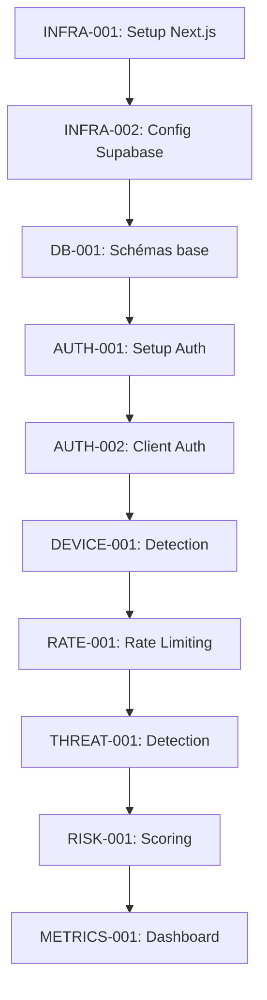

# Roadmap Complète du Starter SaaS

> Roadmap exhaustive pour l'implémentation de toutes les fonctionnalités proposées dans la documentation technique

## Vue d'ensemble

Cette roadmap détaille l'implémentation complète du starter SaaS en 4 phases principales, couvrant :
- **96 tâches spécifiques** réparties sur 16 semaines
- **Tests immédiats** après chaque fonctionnalité backend
- **Intégration native Supabase** pour les emails et l'authentification
- **Approche test-driven** pour éviter les bugs d'intégration

---

## 🗓️ Timeline Générale

| Phase | Durée | Focus | Tâches |
|-------|-------|-------|--------|
| **Phase 1** | Semaines 1-4 | MVP Core + Tests | 24 tâches |
| **Phase 2** | Semaines 5-8 | Sécurité Avancée | 26 tâches |
| **Phase 3** | Semaines 9-12 | Scalabilité & Performance | 24 tâches |
| **Phase 4** | Semaines 13-16 | Monitoring & Admin | 22 tâches |

---

## 🟢 PHASE 1 : MVP CORE + TESTS (Semaines 1-4)

### **📅 SEMAINE 1 : Infrastructure & Setup Supabase**

#### **Infrastructure Base (4 jours)**

**🔧 INFRA-001 : Setup projet Next.js 15**
- [x] Initialiser projet Next.js 15 avec TypeScript
- [x] Configuration ESLint + Prettier
- [x] Setup Tailwind CSS + Shadcn/ui
- [x] Structure de dossiers selon architecture.md
- [x] **Test** : `npm run dev` démarre sans erreur

**🔧 INFRA-002 : Configuration Supabase**
- [ ] Créer projet Supabase
- [ ] Installer `@supabase/supabase-js`
- [ ] Configuration client Supabase
- [ ] Variables d'environnement (URL, anon key, service key)
- [ ] **Test** : Connexion à Supabase réussie

**🔧 INFRA-003 : Configuration des variables d'environnement**
- [ ] Créer `.env.local` et `.env.example`
- [ ] Validation Zod des variables d'env
- [ ] Fonction `validateEnvironment()`
- [ ] Configuration par environnement (dev/staging/prod)
- [ ] **Test** : Validation des env vars au démarrage

**🔧 INFRA-004 : Setup Redis (Upstash)**
- [ ] Créer base Upstash Redis
- [ ] Configuration client Redis
- [ ] Variables d'environnement Redis
- [ ] Fonctions utilitaires Redis de base
- [ ] **Test** : `redis.ping()` retourne PONG

#### **Base de Données (3 jours)**

**🗄️ DB-001 : Schémas de base PostgreSQL**
- [ ] Table `public.users` avec extension auth.users
- [ ] Table `public.devices` pour tracking appareils
- [ ] Table `public.device_sessions` avec scoring
- [ ] Contraintes et validations SQL
- [ ] **Test** : Migration appliquée sans erreur

**🗄️ DB-002 : Row Level Security (RLS)**
- [ ] Activer RLS sur toutes les tables
- [ ] Policies `users` (view/update own profile)
- [ ] Policies `devices` (manage own devices)
- [ ] Policies `device_sessions` (view/update own sessions)
- [ ] **Test** : Policies fonctionnent avec différents utilisateurs

**🗄️ DB-003 : Triggers et fonctions**
- [ ] Fonction `update_updated_at_column()`
- [ ] Triggers sur toutes les tables pour `updated_at`
- [ ] Fonction custom `verify_user_password()`
- [ ] Index de base pour performances
- [ ] **Test** : Triggers se déclenchent automatiquement

### **📅 SEMAINE 2 : Authentification de Base + Tests**

#### **Authentification Core (4 jours)**

**🔐 AUTH-001 : Setup Supabase Auth**
- [ ] Configuration Supabase Auth dans dashboard
- [ ] Providers activés (Email, Google, GitHub)
- [ ] Configuration Site URL et Redirect URLs
- [ ] Paramètres de sécurité (password policy)
- [ ] **Test** : Dashboard auth configuré correctement

**🔐 AUTH-002 : Client Supabase Auth**
- [ ] Hook `useAuth` avec context React
- [ ] Fonctions `signUp`, `signIn`, `signOut`
- [ ] Gestion des états (loading, user, session)
- [ ] Persistance session dans localStorage
- [ ] **Test** : Hook fonctionne avec mock data

**🔐 AUTH-003 : Routes API authentification**
- [ ] `POST /api/auth/signin` avec validation Zod
- [ ] `POST /api/auth/signup` avec validation
- [ ] `POST /api/auth/signout` 
- [ ] `POST /api/auth/signout-all`
- [ ] **Test** : Toutes les routes retournent 200/400/401 appropriés

**🔐 AUTH-004 : Middleware d'authentification**
- [ ] Extraction du token depuis headers/cookies
- [ ] Validation session Supabase
- [ ] Ajout `user` et `session` dans req
- [ ] Gestion des routes publiques/privées
- [ ] **Test** : Middleware bloque/autorise selon auth

#### **Templates Email Supabase (3 jours)**

**📧 EMAIL-001 : Configuration templates Supabase**
- [ ] Template "Confirm Signup" personnalisé
- [ ] Template "Reset Password" personnalisé  
- [ ] Template "Magic Link" personnalisé
- [ ] Template "Email Change" personnalisé
- [ ] **Test** : Envoi de chaque template via dashboard

**📧 EMAIL-002 : Intégration templates dans l'app**
- [ ] Configuration redirections après email
- [ ] Page `/auth/confirm` pour traiter callbacks
- [ ] Page `/auth/reset-password` pour reset
- [ ] Gestion des erreurs de tokens expirés
- [ ] **Test** : Flow complet signup → email → confirm

**📧 EMAIL-003 : SMTP Configuration (optionnel)**
- [ ] Configuration SMTP custom si nécessaire
- [ ] Test avec différents providers (Resend, etc.)
- [ ] Fallback vers SMTP Supabase par défaut
- [ ] Variables d'environnement SMTP
- [ ] **Test** : Emails reçus dans boîte réelle

### **📅 SEMAINE 3 : Gestion Appareils + Sessions**

#### **Device Detection & Tracking (4 jours)**

**📱 DEVICE-001 : Détection d'appareils**
- [ ] Parsing User-Agent (browser, OS, device)
- [ ] Détection IP et géolocalisation basique
- [ ] Fingerprinting basique (screen, timezone, langue)
- [ ] Stockage informations device en base
- [ ] **Test** : Device detection sur différents navigateurs

**📱 DEVICE-002 : Scoring de confiance**
- [ ] Algorithme scoring basé sur similarité
- [ ] Comparaison browser (30 pts), OS (25 pts), IP (20 pts)
- [ ] Stockage historique des scores
- [ ] Mise à jour scores lors connexions
- [ ] **Test** : Scores cohérents selon similarité devices

**📱 DEVICE-003 : Gestion des sessions device**
- [ ] Table `device_sessions` avec scoring
- [ ] Liaison session Supabase ↔ device session
- [ ] Calcul et stockage du niveau de confiance
- [ ] Expiration et nettoyage sessions
- [ ] **Test** : Sessions créées/mises à jour automatiquement

**📱 DEVICE-004 : Hook useDeviceSession**
- [ ] Hook React pour session device courante
- [ ] États (loading, deviceSession, confidenceScore)
- [ ] Actions (updateDevice, trustDevice)
- [ ] Synchronisation avec session Supabase
- [ ] **Test** : Hook reflète l'état réel de la session

#### **Interface Utilisateur Auth (3 jours)**

**🎨 UI-001 : Pages d'authentification**
- [ ] Page `/auth/signin` avec formulaire
- [ ] Page `/auth/signup` avec validation
- [ ] Page `/auth/forgot-password`
- [ ] Design responsive avec Shadcn/ui
- [ ] **Test** : Formulaires fonctionnent end-to-end

**🎨 UI-002 : Composants auth réutilisables**
- [ ] Composant `AuthForm` générique
- [ ] Composant `PasswordInput` avec force meter
- [ ] Composant `SocialAuthButtons`
- [ ] Gestion des états loading/error
- [ ] **Test** : Composants fonctionnent isolément

**🎨 UI-003 : Navigation et protection routes**
- [ ] Composant `ProtectedRoute`
- [ ] Redirection automatique selon auth
- [ ] Navigation conditionnelle (login/logout)
- [ ] Breadcrumbs et états de navigation
- [ ] **Test** : Navigation fonctionne selon auth status

### **📅 SEMAINE 4 : Validation & Rate Limiting**

#### **Validation & API Structure (4 jours)**

**✅ VALID-001 : Schémas de validation Zod**
- [ ] Schémas pour auth (signin, signup, reset)
- [ ] Schémas pour user profile
- [ ] Schémas pour device management
- [ ] Messages d'erreur personnalisés
- [ ] **Test** : Validation rejette données invalides

**✅ VALID-002 : Middleware de validation globale**
- [ ] Middleware `validateRequest<T>(schema)`
- [ ] Intégration avec toutes les routes API
- [ ] Gestion d'erreurs de validation standardisée
- [ ] Response format cohérent
- [ ] **Test** : Toutes les routes API sont protégées

**✅ VALID-003 : Gestion d'erreurs centralisée**
- [ ] Class `AppError` avec codes d'erreur
- [ ] Handler global d'erreurs API
- [ ] Logging structuré des erreurs
- [ ] Interface utilisateur pour erreurs
- [ ] **Test** : Erreurs sont catchées et loggées

**✅ VALID-004 : Format de réponses API standardisé**
- [ ] Interface `APIResponse<T>` et `APIError`
- [ ] Wrapper functions pour responses
- [ ] Meta-données (requestId, timestamp)
- [ ] Pagination pour listes
- [ ] **Test** : Toutes les API suivent le format

#### **Rate Limiting de Base (3 jours)**

**🚦 RATE-001 : Rate limiting Redis**
- [ ] Class `RedisRateLimiter` 
- [ ] Configuration par endpoint (signin, signup, etc.)
- [ ] Middleware `rateLimit(endpoint, identifier)`
- [ ] Headers de rate limit dans responses
- [ ] **Test** : Rate limiting fonctionne par IP/user

**🚦 RATE-002 : Configuration des limites**
- [ ] Limites signin (5/min), signup (3/min)
- [ ] Limites forgot-password (2/5min)
- [ ] Limites verify-code (10/min)
- [ ] Configuration env variables pour seuils
- [ ] **Test** : Limites sont respectées et configurables

**🚦 RATE-003 : Interface de monitoring**
- [ ] Dashboard basique rate limiting
- [ ] Métriques Redis (hits, misses)
- [ ] Alertes dépassement seuils
- [ ] Reset manuel des compteurs
- [ ] **Test** : Dashboard affiche métriques en temps réel

---

## 🟡 PHASE 2 : SÉCURITÉ AVANCÉE (Semaines 5-8)

### **📅 SEMAINE 5 : Rate Limiting Avancé & Protection**

#### **Rate Limiting Intelligent (4 jours)**

**🚦 RATE-004 : Rate limiting adaptatif**
- [ ] Calcul multiplicateur basé sur device trust score
- [ ] Bonus pour utilisateurs vérifiés
- [ ] Malus pour appareils suspects
- [ ] Configuration dynamique des multiplicateurs
- [ ] **Test** : Limites s'adaptent selon confiance

**🚦 RATE-005 : Rate limiting par patterns**
- [ ] Détection tentatives de brute force
- [ ] Escalade progressive des sanctions
- [ ] Whitelist IPs de confiance
- [ ] Blacklist temporaire IPs malveillantes
- [ ] **Test** : Brute force détecté et bloqué

**🚦 RATE-006 : Intégration avec threat detection**
- [ ] Communication rate limiter ↔ threat detector
- [ ] Ajustement limites selon niveau de menace
- [ ] Historique des violations par IP/user
- [ ] Métriques de sécurité avancées
- [ ] **Test** : Threat level influence rate limits

**🚦 RATE-007 : Interface d'administration rate limiting**
- [ ] Dashboard admin pour rate limiting
- [ ] Configuration en temps réel des seuils
- [ ] Visualisation des violations
- [ ] Actions admin (reset, ban, whitelist)
- [ ] **Test** : Admin peut ajuster limites dynamiquement

#### **Protection CSRF & XSS (3 jours)**

**🛡️ CSRF-001 : Protection CSRF avec tokens**
- [ ] Génération tokens CSRF rotatifs
- [ ] Middleware validation CSRF sur mutations
- [ ] Stockage tokens en Redis avec TTL
- [ ] Intégration avec formulaires React
- [ ] **Test** : Requêtes sans CSRF token sont rejetées

**🛡️ CSRF-002 : Content Security Policy (CSP)**
- [ ] Headers CSP restrictifs
- [ ] Configuration pour Shadcn/ui et Tailwind
- [ ] Gestion des nonces pour scripts inline
- [ ] Reporting des violations CSP
- [ ] **Test** : CSP bloque scripts malveillants

**🛡️ CSRF-003 : Protection XSS**
- [ ] Sanitisation automatique des inputs
- [ ] Validation stricte des outputs
- [ ] Headers sécurisés (X-Frame-Options, etc.)
- [ ] Configuration Next.js security headers
- [ ] **Test** : Tentatives XSS sont neutralisées

### **📅 SEMAINE 6 : Système 2FA Complet**

#### **TOTP & Backup Codes (4 jours)**

**🔐 2FA-001 : Configuration TOTP**
- [ ] Génération secrets TOTP par user
- [ ] QR codes avec libraries (qrcode, otpauth-url)
- [ ] Table storage des secrets chiffrés
- [ ] Interface setup 2FA dans profil user
- [ ] **Test** : Setup 2FA avec Google Authenticator

**🔐 2FA-002 : Vérification TOTP**
- [ ] Route `POST /api/auth/verify-2fa`
- [ ] Validation codes TOTP avec window tolerance
- [ ] Mise à jour AAL de AAL1 vers AAL2
- [ ] Protection contre replay attacks
- [ ] **Test** : Codes TOTP valides donnent AAL2

**🔐 2FA-003 : Codes de sauvegarde**
- [ ] Génération 10 codes backup par user
- [ ] Hachage bcrypt des codes backup
- [ ] Table `backup_codes` avec tracking usage
- [ ] Interface téléchargement codes
- [ ] **Test** : Codes backup fonctionnent une fois

**🔐 2FA-004 : Interface utilisateur 2FA**
- [ ] Page `/settings/security` pour 2FA
- [ ] Composant setup TOTP avec QR code
- [ ] Liste des codes backup avec révélation
- [ ] Disable/re-enable 2FA avec confirmation
- [ ] **Test** : Interface 2FA complète fonctionnelle

#### **Email OTP Supabase (3 jours)**

**📧 OTP-001 : Configuration Email OTP**
- [ ] Modification template Magic Link pour OTP
- [ ] Ajout variable `{{ .Token }}` dans template
- [ ] Configuration expiration OTP (10 min)
- [ ] Limitation fréquence envoi (1/60s)
- [ ] **Test** : Email OTP 6 chiffres reçu

**📧 OTP-002 : Intégration Email OTP dans app**
- [ ] Route `POST /api/auth/send-otp`
- [ ] Route `POST /api/auth/verify-otp`
- [ ] Interface OTP dans signin/signup
- [ ] Fallback OTP si 2FA indisponible
- [ ] **Test** : Flow OTP end-to-end fonctionnel

**📧 OTP-003 : Sécurité Email OTP**
- [ ] Rate limiting spécifique OTP
- [ ] Prévention énumération emails
- [ ] Logging tentatives OTP
- [ ] Invalidation OTP après succès
- [ ] **Test** : Sécurité OTP résiste aux attaques

### **📅 SEMAINE 7 : Authentification Assurance Level (AAL)**

#### **Gestion AAL & Vérifications (4 jours)**

**🏛️ AAL-001 : Système AAL complet**
- [ ] Enum `AAL { AAL1, AAL2 }` et types
- [ ] Fonction `determineAAL(authMethod, mfaVerified)`
- [ ] Stockage AAL dans device_sessions
- [ ] Middleware `requireAAL(level)` pour routes
- [ ] **Test** : AAL déterminé correctement selon auth

**🏛️ AAL-002 : Actions sensibles AAL2**
- [ ] Liste actions nécessitant AAL2
- [ ] Protection routes admin avec AAL2
- [ ] Interface demande élévation AAL
- [ ] Timeout AAL2 et re-authentication
- [ ] **Test** : Actions sensibles bloquées sans AAL2

**🏛️ AAL-003 : Vérification appareils inconnus**
- [ ] Détection nouveaux appareils (score < 40)
- [ ] Envoi email verification device
- [ ] Page `/auth/verify-device` avec code
- [ ] Mise à jour confiance après vérification
- [ ] **Test** : Device verification flow complet

**🏛️ AAL-004 : Table verification_codes**
- [ ] Schema table avec types (email, device, 2fa)
- [ ] Génération codes avec expiration
- [ ] Validation et consumption codes
- [ ] Nettoyage automatique codes expirés
- [ ] **Test** : Codes générés, validés, expirés correctly

#### **Magic Links Supabase (3 jours)**

**🔗 MAGIC-001 : Configuration Magic Links**
- [ ] Template Magic Link personnalisé
- [ ] Configuration redirections après clic
- [ ] Sécurité contre prefetch emails
- [ ] Integration avec device detection
- [ ] **Test** : Magic link login end-to-end

**🔗 MAGIC-002 : Interface Magic Links**
- [ ] Option "Se connecter sans mot de passe"
- [ ] Page `/auth/magic-link-sent`
- [ ] Gestion expiration/erreurs magic links
- [ ] Fallback vers login classique
- [ ] **Test** : Interface magic link intuitive

**🔗 MAGIC-003 : Sécurité Magic Links**
- [ ] Rate limiting envoi magic links
- [ ] Validation domaines autorisés
- [ ] Protection contre attaques timing
- [ ] Logging utilisation magic links
- [ ] **Test** : Magic links sécurisés contre abus

### **📅 SEMAINE 8 : Chiffrement & Hachage**

#### **Cryptographie Avancée (4 jours)**

**🔒 CRYPTO-001 : Chiffrement données sensibles**
- [ ] Class `DataEncryption` avec AES-256-GCM
- [ ] Chiffrement secrets 2FA, tokens, etc.
- [ ] Rotation automatique clés de chiffrement
- [ ] Variables d'env pour clés crypto
- [ ] **Test** : Données chiffrées/déchiffrées correctement

**🔒 CRYPTO-002 : Hachage mots de passe**
- [ ] Class `PasswordHash` avec bcrypt (12 rounds)
- [ ] Validation force mots de passe
- [ ] Fonction custom `verify_user_password()` SQL
- [ ] Protection contre timing attacks
- [ ] **Test** : Hachage/vérification passwords sécurisés

**🔒 CRYPTO-003 : Sécurisation stockage clés**
- [ ] Configuration HSM ou vault si production
- [ ] Séparation clés par environnement
- [ ] Audit accès aux clés sensibles
- [ ] Backup et recovery clés
- [ ] **Test** : Clés stockées et rotées sécurisément

**🔒 CRYPTO-004 : Intégrité données**
- [ ] Signatures HMAC pour données critiques
- [ ] Validation intégrité à chaque lecture
- [ ] Détection modification non autorisée
- [ ] Alertes violations intégrité
- [ ] **Test** : Modifications détectées et rejetées

#### **Audit & Logging (3 jours)**

**📝 AUDIT-001 : Table account_events**
- [ ] Schema complet avec event_type, metadata
- [ ] Logging automatique actions utilisateur
- [ ] Partitioning par date pour performance
- [ ] Retention policy et archivage
- [ ] **Test** : Events loggés automatiquement

**📝 AUDIT-002 : Logging sécurité centralisé**
- [ ] Intégration avec Winston ou Pino
- [ ] Formats logs structurés (JSON)
- [ ] Niveaux debug/info/warn/error
- [ ] Rotation et compression logs
- [ ] **Test** : Logs centralisés et structurés

**📝 AUDIT-003 : Monitoring événements sécurité**
- [ ] Alertes tentatives brute force
- [ ] Notifications nouveaux appareils
- [ ] Tracking changements sensibles
- [ ] Dashboard temps réel événements
- [ ] **Test** : Alertes déclenchées pour events suspects

---

## 🔵 PHASE 3 : SCALABILITÉ & PERFORMANCE (Semaines 9-12)

### **📅 SEMAINE 9 : Threat Detection - Patterns**

#### **Détection Brute Force & Velocity (4 jours)**

**🕵️ THREAT-001 : Détection brute force**
- [ ] Algorithme détection tentatives répétées
- [ ] Seuils configurables par endpoint
- [ ] Tracking par IP, user, device combination
- [ ] Escalade sanctions (warn → block)
- [ ] **Test** : Brute force détecté et bloqué automatiquement

**🕵️ THREAT-002 : Détection velocity anomalies**
- [ ] Analyse vitesse requêtes par user
- [ ] Baseline normal behavior par user
- [ ] Détection pics anormaux d'activité
- [ ] Score de risque basé sur velocity
- [ ] **Test** : Activité anormale détectée et scorée

**🕵️ THREAT-003 : Pattern storage Redis**
- [ ] Structure données pour patterns en Redis
- [ ] TTL automatique pour cleanup
- [ ] Compression données historiques
- [ ] Queries optimisées pour analyse
- [ ] **Test** : Patterns stockés et récupérés efficacement

**🕵️ THREAT-004 : Machine learning basique**
- [ ] Algorithmes simple classification anomalies
- [ ] Training data depuis historical events
- [ ] Modèle léger pour detection temps réel
- [ ] Re-training périodique modèle
- [ ] **Test** : ML détecte patterns non obvius

#### **Analytics Comportementaux (3 jours)**

**📊 ANALYTICS-001 : Tracking comportement utilisateur**
- [ ] Events tracking (page views, clicks, time)
- [ ] Patterns navigation normaux vs suspects
- [ ] Fingerprinting comportemental avancé
- [ ] Stockage efficient analytics data
- [ ] **Test** : Comportement tracké et analysé

**📊 ANALYTICS-002 : Baseline établissement**
- [ ] Profils comportementaux par user
- [ ] Métriques moyennes par demographic
- [ ] Adaptation baseline selon usage
- [ ] Detection déviations significatives
- [ ] **Test** : Baselines établies et mises à jour

**📊 ANALYTICS-003 : Alertes comportementales**
- [ ] Seuils alerte par type d'anomalie
- [ ] Escalade automatique selon severity
- [ ] Intégration avec notification system
- [ ] Dashboard visualisation anomalies
- [ ] **Test** : Anomalies détectées et alertées

### **📅 SEMAINE 10 : Threat Detection - Géo & Temporal**

#### **Détection Géographique (4 jours)**

**🌍 GEO-001 : Géolocalisation IP**
- [ ] Service géolocalisation (MaxMind/IP2Location)
- [ ] Cache géolocation fréquentes
- [ ] Détection pays/régions habituels par user
- [ ] Scoring distance géographique
- [ ] **Test** : Géolocation précise et fast

**🌍 GEO-002 : Anomalies géographiques**
- [ ] Baseline locations par user
- [ ] Détection connexions pays inhabituels
- [ ] Scoring risque basé sur distance
- [ ] Alertes connexions lointaines
- [ ] **Test** : Connexions lointaines détectées

**🌍 GEO-003 : Voyage impossible detection**
- [ ] Calcul temps voyage physiquement possible
- [ ] Détection connexions géographiquement impossibles
- [ ] Score risque voyage impossible
- [ ] Escalade automatique cas suspects
- [ ] **Test** : Voyage impossible détecté correctement

**🌍 GEO-004 : Géofencing intelligent**
- [ ] Zones géographiques autorisées par user
- [ ] Géofencing entreprise ou personnel
- [ ] Exceptions temporaires géofencing
- [ ] Notifications sorties de zones
- [ ] **Test** : Géofencing fonctionne selon règles

#### **Détection Temporelle (3 jours)**

**⏰ TEMPORAL-001 : Patterns temporels**
- [ ] Baseline heures habituelles par user
- [ ] Détection connexions heures anormales
- [ ] Patterns hebdomadaires/mensuels
- [ ] Score risque basé sur timing
- [ ] **Test** : Connexions heures anormales détectées

**⏰ TEMPORAL-002 : Fréquence anomalies**
- [ ] Détection fréquence excessive connexions
- [ ] Patterns inhumains (trop rapide/régulier)
- [ ] Detection bots via temporal patterns
- [ ] Scoring comportement automatisé
- [ ] **Test** : Comportement bot détecté

**⏰ TEMPORAL-003 : Time-based security**
- [ ] Restrictions horaires par role/user
- [ ] Escalade sécurité heures sensibles
- [ ] Notifications activité hors heures
- [ ] Policies temporelles configurables
- [ ] **Test** : Restrictions temporelles appliquées

### **📅 SEMAINE 11 : Scoring de Risque & Réponses**

#### **Algorithme Scoring Avancé (4 jours)**

**🎯 RISK-001 : Moteur scoring multi-facteurs**
- [ ] Algorithme scoring combinant tous facteurs
- [ ] Poids configurables par type de risque
- [ ] Score composite normalisé (0-100)
- [ ] Historique évolution scores par user
- [ ] **Test** : Scores reflètent niveau risque réel

**🎯 RISK-002 : Machine learning scoring**
- [ ] Features engineering pour ML model
- [ ] Training model classification risque
- [ ] Pipeline inference temps réel
- [ ] A/B testing règles vs ML
- [ ] **Test** : ML améliore précision détection

**🎯 RISK-003 : Adaptation scoring context**
- [ ] Scoring différent par type d'action
- [ ] Context-aware risk assessment
- [ ] Facteurs externes (time, geo, device)
- [ ] Calibration scoring selon feedback
- [ ] **Test** : Scoring s'adapte au contexte

**🎯 RISK-004 : Performance scoring**
- [ ] Optimisation calcul score (< 10ms)
- [ ] Cache scores fréquents
- [ ] Calcul incrémental vs full
- [ ] Métriques performance scoring
- [ ] **Test** : Scoring rapide même haute charge

#### **Réponses Automatisées (3 jours)**

**🤖 RESPONSE-001 : Actions automatiques par score**
- [ ] Matrice score → action (log, warn, block)
- [ ] Configuration seuils par environnement
- [ ] Escalade progressive sanctions
- [ ] Override manuel réponses auto
- [ ] **Test** : Actions déclenchées selon score

**🤖 RESPONSE-002 : Blocage intelligent**
- [ ] Blocage temporaire vs permanent
- [ ] Blocage granulaire (IP, user, device)
- [ ] Whitelist automatique après période
- [ ] Appeals process pour faux positifs
- [ ] **Test** : Blocages appropriés et révocables

**🤖 RESPONSE-003 : Notifications stakeholders**
- [ ] Alertes temps réel équipe sécurité
- [ ] Digest quotidien incidents
- [ ] Intégration Slack/Teams/PagerDuty
- [ ] Escalation selon severity level
- [ ] **Test** : Notifications envoyées promptement

### **📅 SEMAINE 12 : Optimisations Base de Données**

#### **Performance & Indexing (4 jours)**

**🚀 PERF-001 : Index optimisés**
- [ ] Audit queries lentes avec EXPLAIN ANALYZE
- [ ] Index composites pour queries fréquentes
- [ ] Index partiels pour data volumineuse
- [ ] Monitoring performance index
- [ ] **Test** : Queries < 100ms p95

**🚀 PERF-002 : Partitioning tables**
- [ ] Partitioning `account_events` par date
- [ ] Partitioning `verification_codes` par TTL
- [ ] Automated partition management
- [ ] Archiving anciennes partitions
- [ ] **Test** : Partitioning améliore performance

**🚀 PERF-003 : Connection pooling**
- [ ] Configuration Supabase connection pooling
- [ ] Pool sizes optimaux par environnement
- [ ] Monitoring connections usage
- [ ] Fallback strategies si pool saturé
- [ ] **Test** : Pool gère charge élevée

**🚀 PERF-004 : Query optimization**
- [ ] Réecriture queries N+1
- [ ] Batch queries pour bulk operations
- [ ] Pagination efficace large datasets
- [ ] Cache queries fréquentes
- [ ] **Test** : Queries optimisées scalent

#### **Caching Strategy (3 jours)**

**⚡ CACHE-001 : Cache Redis multi-niveaux**
- [ ] L1: Application cache (sessions)
- [ ] L2: Redis cache (user data, configs)
- [ ] L3: Database avec smart invalidation
- [ ] Cache warming strategies
- [ ] **Test** : Cache hits > 80% pour données fréquentes

**⚡ CACHE-002 : Cache invalidation**
- [ ] Invalidation automatique sur mutations
- [ ] TTL adaptatif selon usage
- [ ] Cache tags pour invalidation groupée
- [ ] Monitoring cache hit rates
- [ ] **Test** : Invalidation maintient cohérence

**⚡ CACHE-003 : CDN pour assets**
- [ ] Configuration CDN pour static assets
- [ ] Cache headers optimaux
- [ ] Image optimization et compression
- [ ] Cache versioning pour deployments
- [ ] **Test** : Assets servies rapidement globalement

---

## 🟣 PHASE 4 : MONITORING & ADMIN (Semaines 13-16)

### **📅 SEMAINE 13 : Dashboard Sécurité**

#### **Métriques & Visualisation (4 jours)**

**📈 METRICS-001 : Dashboard temps réel**
- [ ] Dashboard React avec charts (Recharts/D3)
- [ ] Métriques auth (success rate, failures)
- [ ] Métriques threat detection (alerts, blocks)
- [ ] Métriques performance (response times)
- [ ] **Test** : Dashboard update en temps réel

**📈 METRICS-002 : Alertes configurables**
- [ ] Système alertes basé sur seuils
- [ ] Channels multiples (email, Slack, SMS)
- [ ] Escalation automatique selon severity
- [ ] Snoozing et acknowledgment alertes
- [ ] **Test** : Alertes déclenchées et routed correctly

**📈 METRICS-003 : Reporting automatisé**
- [ ] Rapports quotidiens/hebdomadaires/mensuels
- [ ] PDF generation pour stakeholders
- [ ] Trends analysis et recommendations
- [ ] Archivage rapports historiques
- [ ] **Test** : Rapports générés et envoyés automatiquement

**📈 METRICS-004 : Analytics avancées**
- [ ] Funnel analysis authentication
- [ ] Cohort analysis user behavior
- [ ] Attribution analysis security events
- [ ] Predictive analytics threat trends
- [ ] **Test** : Analytics fournissent insights actionnables

#### **Observabilité (3 jours)**

**🔍 OBSERV-001 : Logging structuré**
- [ ] Structured logging JSON partout
- [ ] Correlation IDs pour request tracing
- [ ] Log aggregation (ELK/Loki stack)
- [ ] Log sampling pour high volume
- [ ] **Test** : Logs searchables et corrélés

**🔍 OBSERV-002 : Métriques applicatives**
- [ ] Custom metrics business logic
- [ ] Histogrammes response times
- [ ] Counters pour events métier
- [ ] Gauges pour states système
- [ ] **Test** : Métriques reflètent état application

**🔍 OBSERV-003 : Tracing distribué**
- [ ] Tracing requests cross-services
- [ ] Integration OpenTelemetry
- [ ] Performance bottlenecks identification
- [ ] Service dependency mapping
- [ ] **Test** : Traces permettent debug performance

### **📅 SEMAINE 14 : Interface Administration**

#### **Admin Panel (4 jours)**

**⚙️ ADMIN-001 : Dashboard administration**
- [ ] Interface admin protégée AAL2
- [ ] Vue d'ensemble système health
- [ ] Navigation intuitive par section
- [ ] Responsive design pour mobile
- [ ] **Test** : Admin panel accessible et fonctionnel

**⚙️ ADMIN-002 : Gestion utilisateurs**
- [ ] Liste/recherche/filtrage users
- [ ] Actions admin (ban, unban, delete)
- [ ] Gestion roles et permissions
- [ ] Audit trail actions admin
- [ ] **Test** : Admin peut gérer users efficacement

**⚙️ ADMIN-003 : Configuration système**
- [ ] Interface configuration temps réel
- [ ] Validation configs avant apply
- [ ] Rollback configurations précédentes
- [ ] Preview impact changements config
- [ ] **Test** : Configs modifiables sans redeploy

**⚙️ ADMIN-004 : Security operations center**
- [ ] Timeline événements sécurité
- [ ] Investigation tools pour incidents
- [ ] Bulk actions sur threats
- [ ] Incident response workflows
- [ ] **Test** : SOC permet response rapide incidents

#### **Automation & Workflows (3 jours)**

**🔄 AUTO-001 : Workflows automatisés**
- [ ] Automated threat response workflows
- [ ] User onboarding automation
- [ ] Cleanup et maintenance automation
- [ ] Integration avec outils externes
- [ ] **Test** : Workflows executent sans intervention

**🔄 AUTO-002 : Scheduled tasks**
- [ ] Cron jobs pour maintenance
- [ ] Database cleanup automatique
- [ ] Report generation scheduling
- [ ] Health checks périodiques
- [ ] **Test** : Tasks scheduled executent reliable

**🔄 AUTO-003 : API integrations**
- [ ] Webhooks pour événements système
- [ ] API externe pour threat intelligence
- [ ] Sync données avec systems externes
- [ ] Error handling et retry logic
- [ ] **Test** : Integrations robustes et reliable

### **📅 SEMAINE 15 : Configuration Avancée**

#### **Hot Reload & Dynamic Config (4 jours)**

**🔧 CONFIG-001 : Configuration dynamique**
- [ ] Hot reload config sans restart
- [ ] Validation configs en temps réel
- [ ] Rollback automatique si config invalide
- [ ] Notification changements config
- [ ] **Test** : Configs changent sans downtime

**🔧 CONFIG-002 : CLI administration**
- [ ] CLI pour gestion configuration
- [ ] Commands pour common operations
- [ ] Batch operations via CLI
- [ ] Integration avec CI/CD pipelines
- [ ] **Test** : CLI permet admin efficace

**🔧 CONFIG-003 : Environment management**
- [ ] Configs par environnement (dev/staging/prod)
- [ ] Promotion configs entre envs
- [ ] Secrets management sécurisé
- [ ] Audit changements configs
- [ ] **Test** : Envs isolés avec configs appropriées

**🔧 CONFIG-004 : Feature flags**
- [ ] System feature flags pour rollouts
- [ ] A/B testing capabilities
- [ ] Gradual rollout nouvelles features
- [ ] Kill switches pour emergency
- [ ] **Test** : Feature flags permettent safe deployments

#### **Monitoring Configuration (3 jours)**

**📊 MONITOR-CONFIG-001 : Health checks**
- [ ] Health endpoints pour tous services
- [ ] Dependency health monitoring
- [ ] Automated recovery procedures
- [ ] Status page public
- [ ] **Test** : Health checks détectent issues rapidement

**📊 MONITOR-CONFIG-002 : Performance monitoring**
- [ ] APM (Application Performance Monitoring)
- [ ] Database performance tracking
- [ ] External services monitoring
- [ ] Capacity planning metrics
- [ ] **Test** : Performance dégradation détectée early

**📊 MONITOR-CONFIG-003 : Error tracking**
- [ ] Centralized error tracking (Sentry)
- [ ] Error grouping et deduplication
- [ ] Error rate alerting
- [ ] Root cause analysis tools
- [ ] **Test** : Errors tracked et resolved quickly

### **📅 SEMAINE 16 : Documentation & Déploiement**

#### **Documentation Complète (4 jours)**

**📚 DOC-001 : Documentation technique**
- [ ] API documentation OpenAPI complète
- [ ] Architecture documentation mise à jour
- [ ] Runbooks pour opérations
- [ ] Troubleshooting guides
- [ ] **Test** : Documentation accurate et utile

**📚 DOC-002 : Documentation utilisateur**
- [ ] User guides pour toutes features
- [ ] Video tutorials pour workflows
- [ ] FAQ comprehensive
- [ ] Search functionality documentation
- [ ] **Test** : Users trouvent réponses facilement

**📚 DOC-003 : Documentation développeur**
- [ ] Setup et development environment
- [ ] Contributing guidelines
- [ ] Code standards et conventions
- [ ] Testing strategies documentation
- [ ] **Test** : Nouveaux devs onboard rapidement

**📚 DOC-004 : Documentation sécurité**
- [ ] Security playbooks
- [ ] Incident response procedures
- [ ] Compliance documentation
- [ ] Security training materials
- [ ] **Test** : Équipe sécurité peut respond efficacement

#### **Production Deployment (3 jours)**

**🚀 DEPLOY-001 : CI/CD pipelines**
- [ ] Automated testing dans pipelines
- [ ] Automated security scans
- [ ] Automated deployment staging
- [ ] Blue-green deployment production
- [ ] **Test** : Deployments automated et safe

**🚀 DEPLOY-002 : Infrastructure as Code**
- [ ] Terraform/CDK pour infrastructure
- [ ] Database migrations automated
- [ ] Secrets management en production
- [ ] Backup et disaster recovery
- [ ] **Test** : Infrastructure reproducible

**🚀 DEPLOY-003 : Production monitoring**
- [ ] Production-specific monitoring
- [ ] Alerting pour production issues
- [ ] Performance baselines production
- [ ] Security monitoring renforcé
- [ ] **Test** : Production monitored comprehensively

---

## 📋 MATRICE DES DÉPENDANCES

### **Dépendances Critiques Inter-Phases**

### **Dépendances par Module**

| Module | Dépendances Critiques |
|--------|---------------------|
| **Infrastructure** | Aucune (point d'entrée) |
| **Database** | INFRA-002 (Supabase config) |
| **Authentication** | DB-001, DB-002, EMAIL-001 |
| **Security** | AUTH-003, DEVICE-001, RATE-001 |
| **Threat Detection** | DEVICE-002, ANALYTICS-001, RATE-004 |
| **Administration** | CONFIG-001, METRICS-001, ADMIN-001 |

---

## ⏱️ ESTIMATIONS & COMPLEXITÉ

### **Répartition Effort par Phase**

| Phase | Tâches Simples | Tâches Moyennes | Tâches Complexes | Total Jours |
|-------|----------------|-----------------|------------------|-------------|
| **Phase 1** | 8 (1-2j) | 12 (3-5j) | 4 (6-10j) | ~80 jours |
| **Phase 2** | 6 (1-2j) | 14 (3-5j) | 6 (6-10j) | ~100 jours |
| **Phase 3** | 4 (1-2j) | 12 (3-5j) | 8 (6-10j) | ~110 jours |
| **Phase 4** | 10 (1-2j) | 8 (3-5j) | 4 (6-10j) | ~70 jours |

### **Points de Risque Identifiés**

🔴 **Risque Élevé:**
- **THREAT-004**: Machine learning - expertise ML requise
- **PERF-002**: Partitioning - expertise PostgreSQL avancée
- **DEPLOY-002**: Infrastructure as Code - expertise DevOps

🟡 **Risque Moyen:**
- **CRYPTO-001**: Cryptographie - attention aux implémentations
- **ADMIN-003**: Config temps réel - complexité state management
- **MONITOR-003**: Tracing distribué - integration complexity

### **Jalons Critiques**

| Semaine | Jalon | Criticité |
|---------|-------|-----------|
| **Semaine 4** | MVP Auth + Device tracking fonctionnel | 🔴 Critique |
| **Semaine 8** | Sécurité avancée + 2FA complet | 🔴 Critique |
| **Semaine 12** | Threat detection + Performance optimisée | 🟡 Important |
| **Semaine 16** | Production ready + Documentation | 🟢 Nice-to-have |

---

## 🧪 STRATÉGIE DE TESTS

### **Tests par Type de Tâche**

**Tests Unitaires** (après chaque fonction/composant):
- Toutes les fonctions utilitaires
- Composants React isolés
- Classes de service métier
- Algorithmes de scoring/detection

**Tests d'Intégration** (après chaque groupe de tâches):
- Flows d'authentification end-to-end
- API routes avec base de données
- Integrations services externes
- Workflows multi-étapes

**Tests de Sécurité** (chaque semaine):
- Penetration testing automatisé
- Vulnerability scanning
- Security regression tests
- Performance under attack

**Tests de Performance** (chaque phase):
- Load testing avec k6/Artillery
- Database performance tests
- Memory/CPU profiling
- Scalability tests

### **Environnements de Test**

1. **Local Development** - Tests unitaires + intégration
2. **Staging** - Tests end-to-end + sécurité
3. **Pre-Production** - Tests performance + load
4. **Production** - Monitoring + canary deployments

---

## 📊 MÉTRIQUES DE SUCCÈS

### **Métriques Techniques**

| Métrique | Objectif | Phase |
|----------|----------|-------|
| **Test Coverage** | > 80% | Toutes |
| **API Response Time** | < 100ms p95 | Phase 3 |
| **Security Score** | A grade | Phase 2 |
| **Uptime** | > 99.9% | Phase 4 |

### **Métriques Business**

| Métrique | Objectif | Phase |
|----------|----------|-------|
| **False Positive Rate** | < 1% | Phase 3 |
| **Mean Time to Resolution** | < 30min | Phase 4 |
| **User Satisfaction** | > 4.5/5 | Phase 4 |
| **Threat Detection Rate** | > 95% | Phase 3 |

---

## 🎯 CONCLUSION

Cette roadmap exhaustive couvre **96 tâches spécifiques** réparties sur **16 semaines**, permettant de construire un starter SaaS complet, sécurisé et scalable.

### **Points Clés:**
- ✅ **Approche test-driven** pour éviter les bugs d'intégration
- ✅ **Fonctionnalités Supabase natives** pour réduire la complexité
- ✅ **Tests immédiats** après chaque implémentation backend
- ✅ **Dépendances claires** pour éviter les blocages
- ✅ **Estimations réalistes** basées sur la complexité

### **Prochaines Étapes:**
1. **Validation roadmap** avec l'équipe
2. **Setup environnement** de développement
3. **Démarrage Phase 1** avec INFRA-001
4. **Mise en place** du système de tracking des tâches

Cette roadmap est vivante et sera mise à jour selon les learnings et les changements de priorités.
